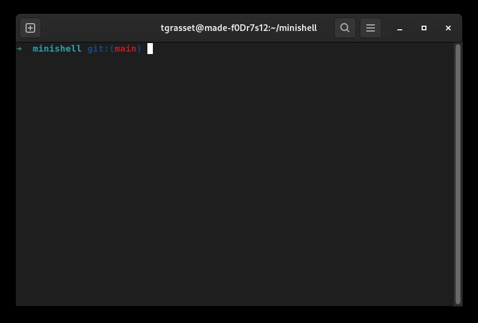

# Minishell

Minishell is a project aimed at creating a simple shell in C, providing basic shell functionalities such as command execution, piping, redirection, environment variables expansion and built-in commands.   

  



## Getting started:
```
git clone https://github.com/tgrasset/minishell.git
cd minishell
./minishell
```

## Features
- Displays a prompt when waiting for a new command.
- Saves a command history accessible with up and down arrow.
- Launches binaries based on PATH variable or using a relative/absolute path.
- Signals and EOF caused by `ctrl-C` and `ctrl-D` are handled similar to bash.
- Simple and double quotes `'' ""` are handled similar to bash.
- `<` creates an input redirection
- `>` creates an output redirection
- `<<` reads input from standard input until a delimiter is found
- `>>` is similar to `>` but appends output instead of truncating
- `|` pipes the output of the previous command as the input of the next one
- `$` followed by an env variable name expands to the value of the variable
- `$?` expands to the exit status of the most recently executed command


## Builtins
The following builtins are implemented:
  - `echo` with option `-n`
  - `cd` with a relative or absolute path
  - `pwd` with no options
  - `export` with no options
  - `unset` with no options
  - `env` with no options or arguments
  - `exit` with no options

## Acknowledgements

This project was made with my teammate [hejingar](https://github.com/hejingar) at 42 school in February and March 2023.